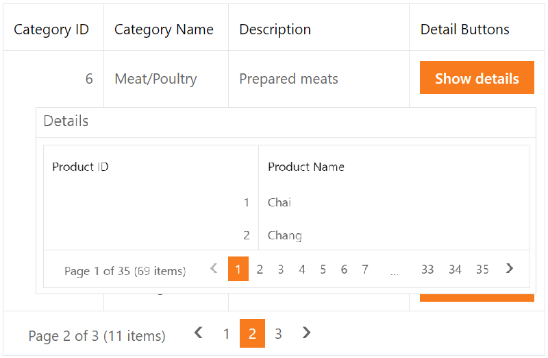

# Grid View for ASP.NET Web Forms - How to display detail grid data in a popup window

This example demonstrates how to create a template in a master grid, add a button to the template, and display a pop-up window with detail grid data on a button click.



## Overview

Follow the steps below to display detail grid data in a pop-up window:

1. Specify a column's [DataItemTemplate](https://docs.devexpress.com/AspNet/DevExpress.Web.GridViewDataColumn.DataItemTemplate) property and add a button to the template.

    ```aspx
    <dx:GridViewDataColumn FieldName="DetailButtons" VisibleIndex="3">
        <DataItemTemplate>
            <dx:ASPxButton ID="DetailButton" runat="server" Text="Show details" AutoPostBack="false"
                OnLoad="DetailsButton_Load">
            </dx:ASPxButton>
        </DataItemTemplate>
    </dx:GridViewDataColumn>
    ```

2. Handle the button's server-side `Load` event to access the button's template container and get the master row's key value. Pass this key value as a parameter to the button's client-side `Click` event.

    ```csharp
    protected void DetailsButton_Load(object sender, EventArgs e) {
        ASPxButton btn = sender as ASPxButton;
        GridViewDataItemTemplateContainer container = btn.NamingContainer as GridViewDataItemTemplateContainer;
        string categoryID = DataBinder.Eval(container.DataItem, "CategoryID").ToString();
        btn.ClientSideEvents.Click = String.Format("function (s, e) {{ OnClick(s, e, {0}) }}", categoryID);
    }
    ```

3. In the button's `Click` event handler, send a callback to a popup control and display the pop-up window with detail grid data on the callback.

    ```js
    function OnClick(s, e, categoryID) {
        Popup.PerformCallback(categoryID);
        Popup.Show();
    }
    ```

4. Handle the popup's server-side `WindowCallback` event to get a detail data source and bind the detail grid to that data source.

    ```csharp
    protected void Popup_WindowCallback(object source, PopupWindowCallbackArgs e) {
        CurrentCategoryID = e.Parameter;
        DetailsApply();
    }
    private void DetailsApply() {
        if (!String.IsNullOrEmpty(CurrentCategoryID)) {
            DetailSource.SelectParameters["CategoryID"].DefaultValue = CurrentCategoryID;
            DetailGrid.DataBind();
        }
    }
    ```

## Files to Review

* [Default.aspx](./CS/WebSite/Default.aspx) (VB: [Default.aspx](./VB/WebSite/Default.aspx))
* [Default.aspx.cs](./CS/WebSite/Default.aspx.cs) (VB: [Default.aspx.vb](./VB/WebSite/Default.aspx.vb))

## Documentation

* [Grid View Templates](https://docs.devexpress.com/AspNet/3718/components/grid-view/concepts/templates)

## More Examples

* [Grid View for ASP.NET Web Forms - How to Display a Popup Dialog When a User Clicks a Link in a Grid Row](https://github.com/DevExpress-Examples/aspxgridview-display-popup-when-user-clicks-cell-link)
